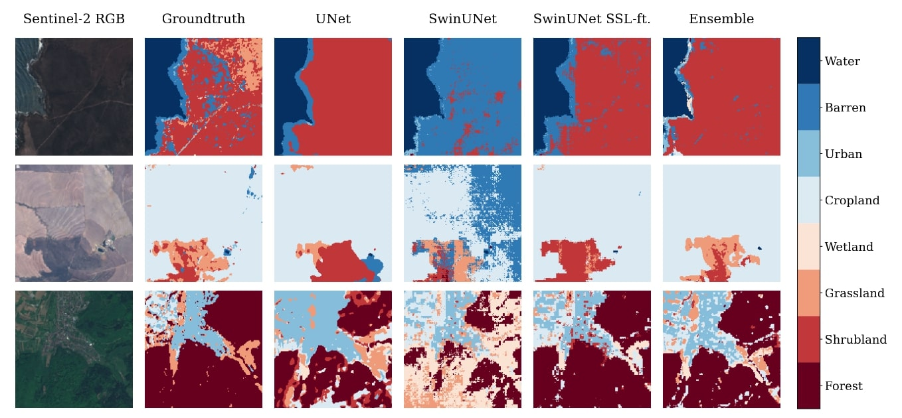

# Self-supervised Vision Transformers for Land-cover Segmentation and Classification
This project aims to provide land-cover classification and segmentation of Satellite images using Deep Learning, by introducing a self-supervised pre-trained Swin Transformer. The training is done in two stages; first, self-supervised training of one unique backbone is performed on a large unlabeled dataset, second, supervised fine-tuning of this backbone is performed on a small, labeled dataset, for two separate downstream tasks.

In this repository, we make the code built for this project (implemented in PyTorch, version 1.11) and pretrained backbones for Sentinel-1 and Sentinel-2 data available to the community. The pretrained backbones are task agnostic and therefore can be readily deployed and fine-tuned to a range of downstream tasks utilizing Sentinel-1 or Sentinel-2 data, or a fusion of both.


**Qualitative comparison of ours segmentation results with different methods (ours: SwinUNet SSL-ft)**


## Self-supervised Training
### ResNet50
The script `train_resnet_backbone.py` trains a model with two ResNet50 backbones for Sentinel-1/2 inputs. The the path to the SEN12MS dataset can be supplied with the `--train_dir` flag.
### Swin-t
The Swin transformer backbones are trained with the `train_d_swin_backbone.py` script. The model code is adapted from
[here](https://github.com/SwinTransformer/Transformer-SSL). Changes to the default parameters, e.g. path to the training data, can be made by adjusting the values in the config file at `configs/backbone_config.json`.

## Downstream Tasks
Fine-tuning and linear evaluation on the classification tasks is done with `train_evaluation.py`. The `downstream_eval_scripts/` directory contains small bash scripts to evaluate the different settings covered in the paper.

You can use the pre-trained weights (downloaded from the [checkpoints](#Checkpoints)) and then run for example:
```bash
# Single-label Classification
python train_evaluation.py --model=DoubleSwinTransformerDownstream --image_px_size=224 --batch_size=8 --checkpoint=/path/to/checkpoint --target dfc_label
# Multi-label Classification
python train_evaluation.py --model=DoubleSwinTransformerDownstream --image_px_size=224 --batch_size=8 --checkpoint=/path/to/checkpoint --target dfc_multilabel_one_hot
# Segmentation
python train_evaluation.py --model=DoubleSwinTransformerSegmentation --image_px_size=224 --batch_size=8 --checkpoint=/path/to/checkpoint --target dfc
```

## Data
The datasets used in this work are publicly available:
* [SEN12MS](https://mediatum.ub.tum.de/1474000) (self-supervised pre-training)
* [DFC2020](https://ieee-dataport.org/competitions/2020-ieee-grss-data-fusion-contest#files) (downstream land-cover classification/segmentation)

## Pretrained models 
We provide pretrained ResNet50 and Swin-t transformer backbones trained with Sentinel-1/2 pairs from SEN12MS (self-supervised):
* [ResNet50](https://drive.google.com/file/d/1txqsNLUhIiQXRxflK_SMHn4y7Pp8o3mZ/view?usp=sharing)
* [Swin-t](https://drive.google.com/file/d/1e7QhC2-zoBFgb65yN1ADWBZLMShHOweY/view?usp=sharing)
* [ResNet18](https://drive.google.com/file/d/1vbj9WVK-MZNuAJGEOGEvE663b9BUwPSh/view?usp=sharing)

These backbones can be readily fine-tuned to a range of downstream tasks that utilize Sentinel-1 data, Sentinel-2 data or the fusion of both. We provide example Jupyter Notebooks for utilizing these pretrained backbones:

* `demo/demo_resnet_backbone.ipynb`, for classification using a self-supervised pre-trained `ResNet` backbone, utilizing Sentinel-2 multi-band imaging data, only;
* `demo/demo_swin_backbone.ipynb`, for classification using a self-supervised pre-trained `SwinTransformer` backbone, utilizing a fusion of Sentinel-1 and Sentinel-2 data.

## Acknowledging this work

If you would like to cite our work, please use the following reference:

* Scheibenreif, Hanna, Mommert, Borth, *Self-supervised Vision Transformers for Land-cover Segmentation and Classification*, Proceedings of the IEEE/CVF Conference on Computer Vision and Pattern Recognition (CVPR) Workshops, 2022, pp. 1422-1431

and/or

* Scheibenreif, Mommert, Borth, *Contrastive Self-Supervised Data Fusion for Satellite Imagery*,  ISPRS Annals of the Photogrammetry, Remote Sensing and Spatial Information Sciences, Volume V-3-2022


## Code
This repository incorporates code from the following sources:
* [Data handling](https://github.com/lukasliebel/dfc2020_baseline)
* [SimCLR](https://github.com/sthalles/SimCLR)
* [Swin Transformer](https://github.com/SwinTransformer/Transformer-SSL)
* [Swin-Unet](https://github.com/HuCaoFighting/Swin-Unet)

